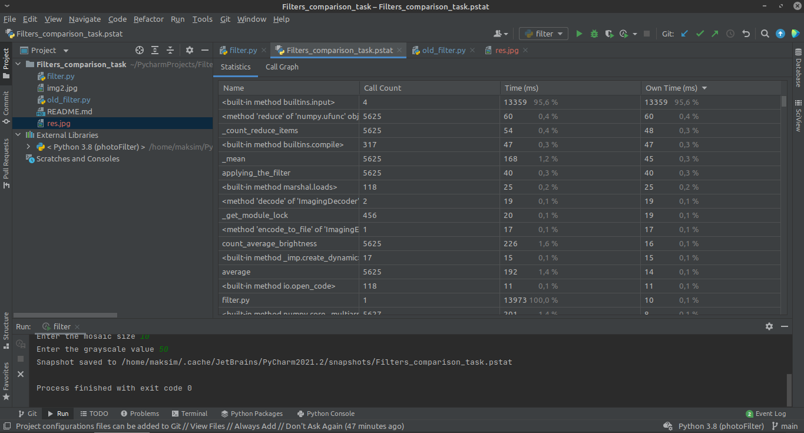
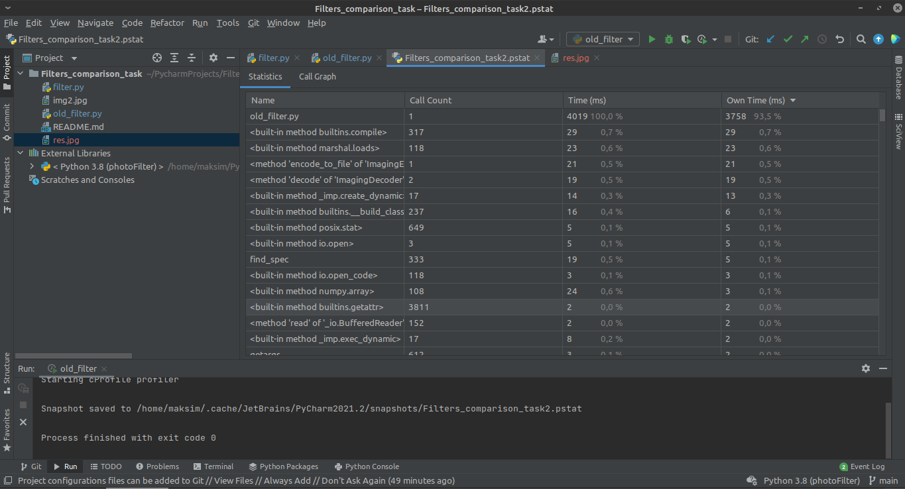
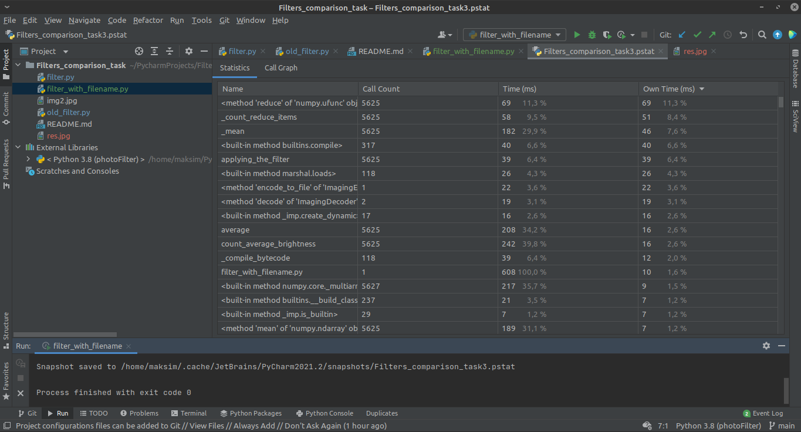

<h1>Отчет</h1>

Имеем 2 версии фильтра для фотографий - оптимизированный filter.py и первоначальный old_filter.py
Сравнивать их будем на примере этого изображения

_____

Вот время выполнения работы filter

и вот время выполнения работы old_filter

Казалось бы, где оптимизация? Но версия filter.py предполагает ввод 4х переменных. Поэтому, чтобы замерить время работы кода без этих погрешностей добавим еще один файл - filter_with_filename.py, в котором заранее будут указаны имя input-файла "img2", имя output-файла "res.jpg", размер блока 10, 50 градаций серого. Тогда без временных затрат на ввод данных будут следующие результаты:

Все всё понимают - матричные преобразования numpy на 2 порядка эффективнее ручных вычислений двумя циклами
_____

Теперь займемся выделенными функциями count_average_brightness и applying_the_filter. Допишем документацию и doc-тесты

*скриншот5

Текстовая версия тестов:

**  
** список тестов  
**  

______

Результат работы с отладчиком:

*скриншоты6-n
